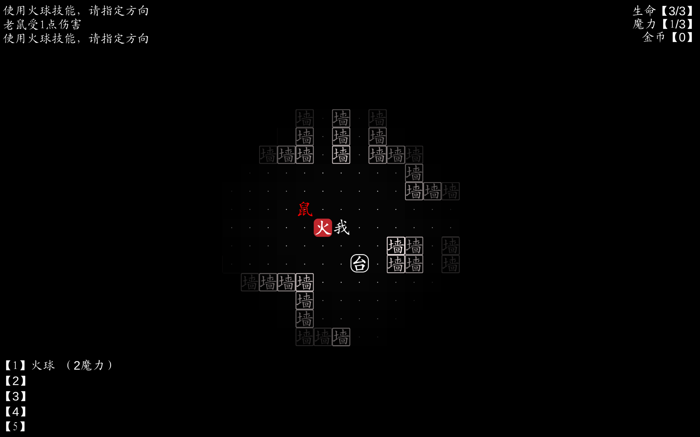

# Zi 字
A roguelike, paying homage to the original Rogue!
## About

### Description
'Zi', or in Chinese '字' is a roguelike that pays homage to the original Rogue. With its extremely simple text based graphics, procedurally generated dungeons and RNG. This game has various spells and enemies for the player to experience, and even a boss stage at the end!
 
Unfortunately, this project is less accessible to English speaking users. However, you may [contact me](https://github.com/AustinKong) for a live demo and explaination.
  
Features:

* Turn based combat, time your spells right and dodge enemy attacks!
* Procedurally generated dungeon
* Several different spells for the player to use
* Several enemies with different attack patterns
* Boss level at the end of the game
* Health system and mana system for spellcasting

 

Some info (For non-Chinese speakers):
* The player character is represented by me '我'
* Navigate to stairs '梯' to start the game, and progres to the next level
* '墙' are walls, they cannot be walked through
* '生命' at the top right, refers to health points
* '魔力' at the top right, refers to mana, this regenerates over time
* '金币' at the top right, refers to coins, they can be used at altars '台' to gain powerups!
* Cast spells by pressing 1 to 5, once the key is pressed, use arrow keys to designate a direction to cast
* When enemies are killed, they drop coins '币'. Pick them up by walking over it
* '箱' are chests, walk over them to open
* '书' are tomes, walk over them to learn a new spell, select an empty spell slot (1 to 5) to designate it

### Technology
* Unity: Game engine to run the simulation
* C#: Backend logic
## Getting Started
### Deployment
Download instructions for users (for Windows only):
1. Download [Release1.0.0.zip](https://github.com/AustinKong/koi/releases/tag/1.0.0)
2. Unzip Release1.0.0.zip
3. Run 'Project Koi.exe'
### Dependencies
* Unity
### Installation
Installation and setup instructions for developers:
1. Install Unity Hub
2. Install Unity version 2020.3.30f1 or recommended LTS
3. Fork and clone the repository
4. Start coding and build something awesome!
### Contributing
This project is no longer under active development. Suggestions, issues and bug reports will not be actively resolved. However, pull requests and forks are always welcome!
## Help
### Controls
	Alt + F4 - Quit
	Esc - Restarts whole game
	Arrow keys - Movement in four cardinal directions
	1 to 5 keys - Cast spells
	Space - Cancel using a spell / Wait a turn without moving
	
## Authors
Austin Kong [@AustinKong](https://github.com/AustinKong)   
Special thanks to BlackThornProd for [technique of animating fish](https://youtu.be/9hTnlp9_wX8)

## License
This project is licensed under MIT license. View license in [license.txt](license.txt)
